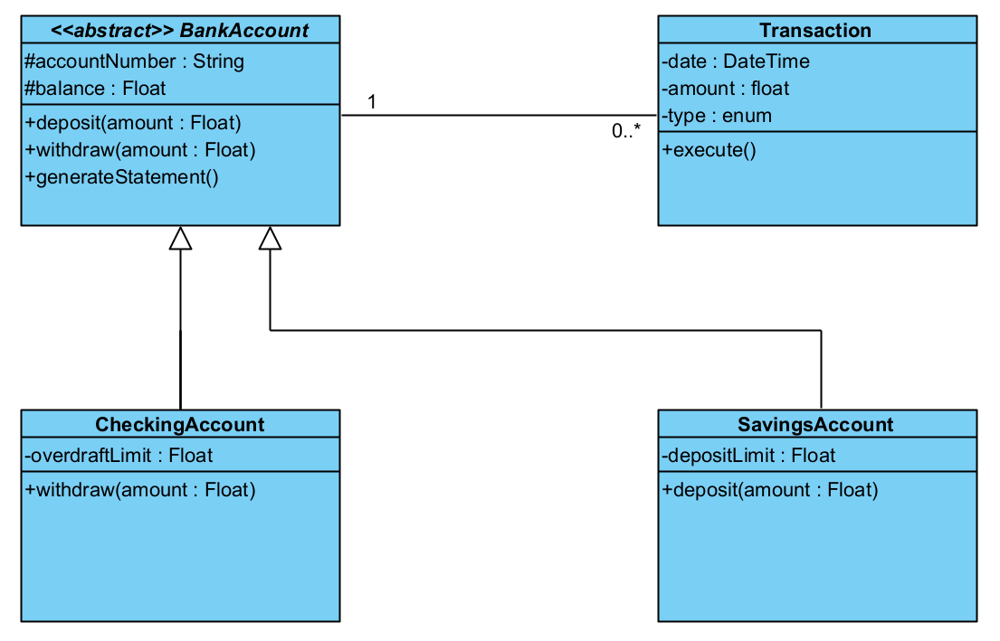

# 💰 Hexa Found Demo Project 💰

## Description

Ce projet est une implémentation d'un système de gestion de comptes bancaires en utilisant l'architecture hexagonale. Il permet de créer des comptes bancaires, de gérer les dépôts et retraits, de gérer les découverts et de fournir des relevés de compte mensuels.

## Fonctionnalités

### Feature 1 : Le compte bancaire

- Création de comptes bancaires avec un numéro de compte unique.
- Gestion du solde des comptes.
- Dépôts d'argent.
- Retraits d'argent avec vérification du solde suffisant.

### Feature 2 : Le découvert

- Autorisation de découvert pour les comptes.
- Gestion des retraits même si le solde est insuffisant, dans la limite de l'autorisation de découvert.

### Feature 3 : Le livret d'épargne

- Création de livrets d'épargne avec un plafond de dépôt.
- Interdiction de découvert sur les livrets d'épargne.

### Feature 4 : Le relevé de compte

- Génération de relevés mensuels des opérations.
- Affichage du type de compte (Livret ou Compte Courant).
- Affichage du solde du compte à la date d'émission.
- Liste des opérations triées par date, ordre antéchronologique.

## Prérequis

- .NET SDK 8.0 ou supérieur
- IDE compatible avec C# (Visual Studio, Rider, Visual Studio Code, etc.)

## Structure du projet

- **src/Core**
  - **DataTransfertObjects** : Contient les objets de transfert de données (DTOs).
  - **Domain** : Contient les entités et les règles métier.
  - **Services.Abstractions** : Contient les interfaces des services.
  - **Services** : Contient les implémentations des services métier.
- **src/Infrastructure**
  - **Persistence** : Contient les implémentations de la persistance des données.
- **src/Presentation**
  - **WebApi** : Contient l'API REST exposant les fonctionnalités de l'application.
- **test**
  - **Persistence.Test** : Contient les tests unitaires et d'intégration pour la persistance.
  - **Services.Test** : Contient les tests unitaires pour les services métier.
  - **WebApi.Test** : Contient les tests d'intégration pour l'API REST.

## Licence

Ce projet est sous licence MIT. Voir le fichier [LICENSE](LICENSE) pour plus d'informations.

